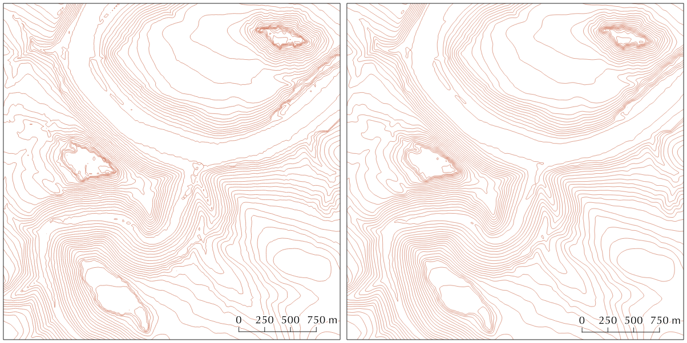

# Smooth Contour Lines
Creating better contour lines from digital elevation models, especially in flat areas. Implementing the algorithm with GDAL after:

> P. Kettunen, C. Koski, and J. Oksanen, “A design of contour generation for topographic maps with adaptive DEM smoothing,” International Journal of Cartography, vol. 3, no. 1, pp. 19–30, Jun. 2017. 
DOI: [10.1080/23729333.2017.1300998](http://dx.doi.org/10.1080/23729333.2017.1300998)

## Usage
 
    create_contours.py --inputDEM=DEMfile.tif --outputFile=contours.gpkg --interval=5 --pixelSize=2

Input is as DEM in any GDAL readable raster format. The output format is guessed from the extension of the file name and can be any file-based vector format supported by [gdal_contour](https://gdal.org/programs/gdal_contour.html). The script calculate also the length of the contour lines. Finde the lenght of each line in the attribute "line_length" and use it to hide to short contour lines. 

The script needs Python and GDAL. On Windows, it should run in the OSGeo4W Shell. 

## Example

The following example image pair demonstrates the result of the generalization process. The contour lines are wrong in some areas but look overall better and smoother. Example for the "Sächsische Schweiz" made with the [DEM (20-meter resolution) form the GeoSN](https://www.geodaten.sachsen.de/digitale-hoehenmodelle-3994.html). Data source GeoSN, dl-de/by-2-0 

## TODO

 - Muliline to Singleline
 - Mark closed lines
 - Code cleanup
 - Write tests
